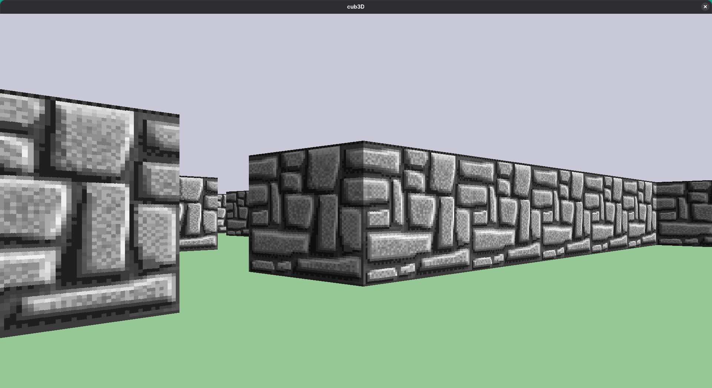
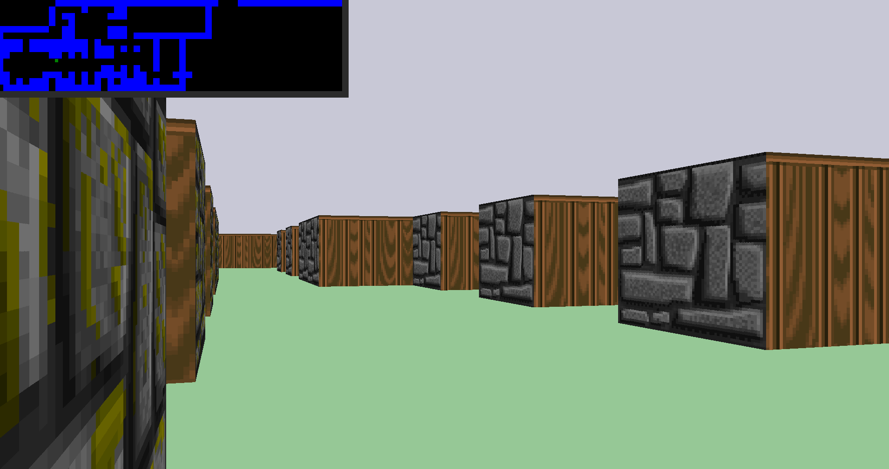
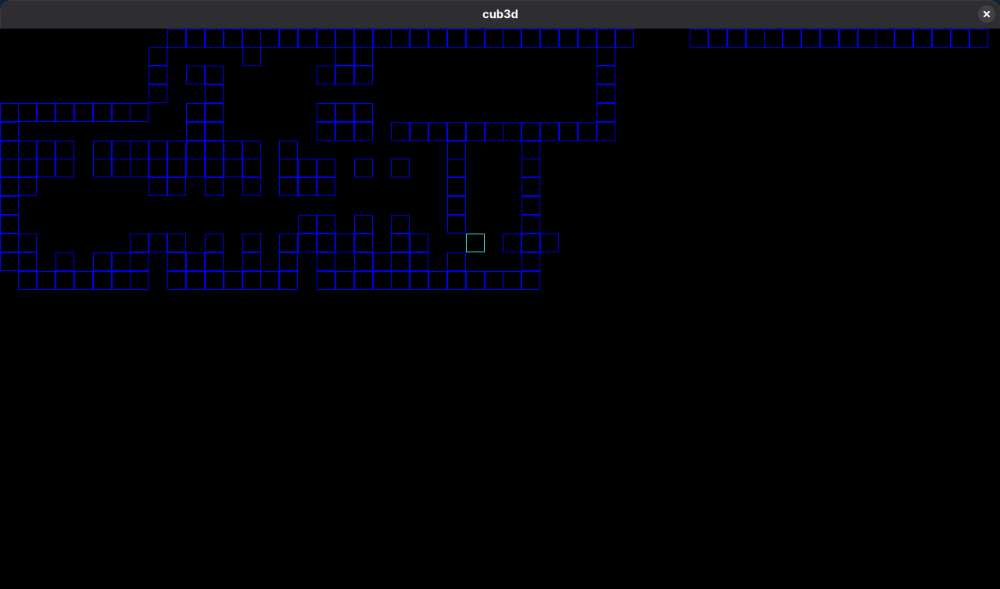

*This project has been created as part of the 42 curriculum by **grui-ant** and **joapedro**.*

# 🧱 42-Cub3d 🔫

## A simple, Wolfenstein-inspired maze explorer, written in C.

*"How can I find my way out of this maze?"*



## Description

We have taken upon ourselves to replicate the greats of the golden era of PC gaming.  
We've made somewhat of a **[Wolfenstein 3D](https://en.wikipedia.org/wiki/Wolfenstein_3D)** clone, but simpler in features, and also <ins>written in C</ins>.

The main purpose of this project is to give us an insight into <ins>low-level graphics</ins>.  
By making a **raycaster** from scratch, similar to the one used in Wolfenstein 3D, we got a pretty decent peek into software rendering.

### Features:

- Wolfenstein 3D-inspired graphics, with:
    - A full, proper <ins>collision system</ins>;
    - A **minimap**, which you can expand;
- A custom **raycaster implementation** built from scratch;
- Classic **DOS Style** controls;
- Usage of the **[42](https://www.42network.org/)** provided <ins>minilibx Graphics Library</ins>;
- Partial static linking with our own **Libft C Library**.

## Instructions

### Building and Running

You will need to compile this program yourself, as no binaries are provided.  
This project was was made with Ubuntu 22.04 as the target platform, so this guide will assume you are on Ubuntu.  
However, you should be able to install the equivalent packages and build on your distro of choice.

#### Prequisites:

Install the following <ins>dependencies</ins>:

- `sudo apt install clang gcc git libxext-dev libbsd-dev make xorg zlib1g-dev`

**Clone** this repository using **Git**, `cd` into it, and pull all dependencies:

- `git clone https://github.com/42-Minishell-Spablob3-TreezZ-Project/Cub3d.git && cd Cub3d`

Once that's done, run **GNU Make** to build the source code into a **executable binary**:

- `make`

`make` will also download and compile the **submodules** required for compilation.  
The `make clean` and `make fclean` flags are also available to **clean up** the files created during compilation, as well as the binary, from the repository.

#### Running the program:
You can <ins>start the program</ins> by running the following command:
- `./cub3d <NAME OF MAP>`

You can choose any of the maps provided in `/maps`.

#### Map details:
A map file needs to abide by the <ins>following guidelines</ins>:
- **Four textures**, which are indicated by four paths:
	- `NO`
	- `SO`
	- `WE`
	- `EA`
		- All of these followed by the path to the texture, which must be in a `.xpm` format.
- **RGB colour values**, for the <ins>Floor</ins> and the <ins>Ceiling</ins>, represented by an `F` and a `C` respectively;
- **A single player**, represented by a `N`, `S`, `E`, or a `W` character (the direction the player will face when the game is loaded);
- A <ins>navigatable arena</ins>, where `0` represents walkable sections, and `1` represents a wall;
	- This arena must be surrounded by `1`'s in order to be valid. In other words, the arena where the player spawns must be closed off;
- The map file must have a `.cub` extension.

**Here's an example of a very simple valid map:**

```
NO ./textures/path_to_the_north_texture.xpm
SO ./textures/path_to_the_south_texture.xpm
WE ./textures/path_to_the_west_texture.xpm
EA ./textures/path_to_the_east_texture.xpm

F  150,200,150 
C  200,200,214

111111111
100000001
100000001
100000001
1000N0001
100000001
100000001
100000001
111111111
```

With this in mind, you can <ins>create your own maps</ins>, as long as you follow said guidelines.

### Gameplay

You'll be relegated to using classic **DOS-style controls**. Which means:

- `W`, `A`, `S`, `D` for moving around;
- **Left** and **Right** arrow keys for looking around



Don't forget you've got a **minimap!** You can zoom it up by pressing the `M` key.  
And that's the gameplay for now. We might add a few things in the future. Or maybe not.

## Resources

- Wolfenstein 3D's Original Source Code: https://github.com/id-Software/wolf3d
- Lode's Computer Graphics Tutorial: https://lodev.org/cgtutor/raycasting.html
- Abdilah CH's Tutorial https://devabdilah.medium.com/3d-ray-casting-game-with-cub3d-7a116376056a
- The various `man` entries on our systems;
- The help of our **colleagues**;
- AI was used as <ins>learning reference</ins>.

## Miscellaneous

#### Enjoy a screenshot of this project in its early stages:


